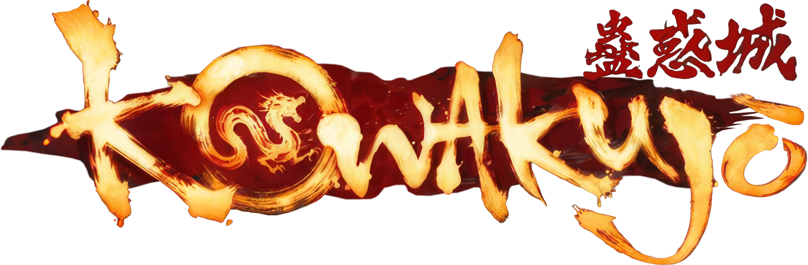

# Kowakujo Solver

  

A simple C++ utility I made to speed up some of the puzzles on the **Kowakujo** Zombies map. Instead of stopping to solve everything by hand, just enter the clues you've found and let the program do the work.

## Current Solvers

### 🔪 Killer Plate Solver

Enter the accomplice, cause of death, and fourth portrait to generate the correct Killer Plate order.

### 🕒 Clock Solver

Enter the victim's time of death and the number of hours before the poison takes effect. The program calculates the correct zodiac hour when the poison was administered.

### 📜 Scroll Puzzle Solver

Enter the scrolls that are currently **out** (for example: `ACE` or `ABEG`). The solver calculates the correct presses and displays the solution as an easy-to-read 3×3 grid.

